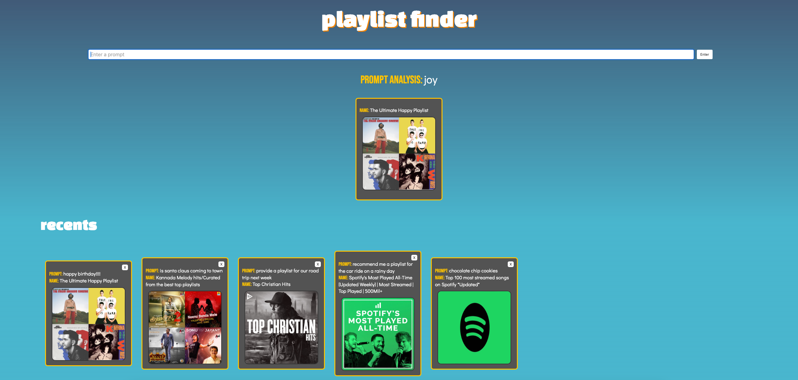

<!-- ABOUT THE PROJECT -->
## About The Project

Discover new music - get recommendations for Spotify playlists with any simple prompt.




### Built With


<!-- GETTING STARTED -->
## Getting Started

To get a local copy up and running follow these example steps.

### Prerequisites

* MongoDB database
* npm
  ```sh
  npm install npm@latest -g
  ```

### Installation

1. Get a free API Key at [https://rapidapi.com/twinword/api/emotion-analysis](https://rapidapi.com/twinword/api/emotion-analysis) and [https://rapidapi.com/Glavier/api/spotify23](https://rapidapi.com/Glavier/api/spotify23)
2. Clone the repo
   ```sh
   git clone https://github.com/waisangu/playlist-finder.git
   ```
3. Install NPM packages
   ```sh
   npm install
   ```
4. Enter your API keys in a newly created .env file in the root directory
   ```js
   MONGODB_URI=ENTER YOUR DATABASE URI
   SPOTIFY_API_KEY=ENTER YOUR API
   EMOTION_ANALYSIS_API_KEY=ENTER YOUR API
   ```
5. Start the application
   ```sh
   npm run dev
   ```


<!-- CONTACT -->
## Contact

Wai San Gu - waisangu@gmail.com

Project Link: [https://github.com/waisangu/playlist-finder](https://github.com/waisangu/playlist-finder)

<p align="right">(<a href="#readme-top">back to top</a>)</p>

